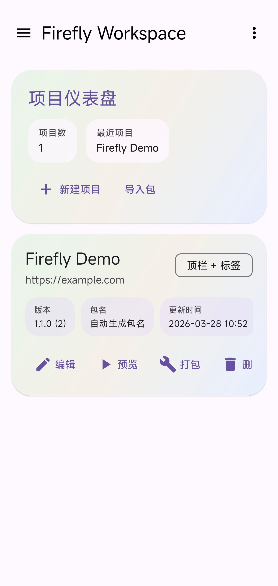
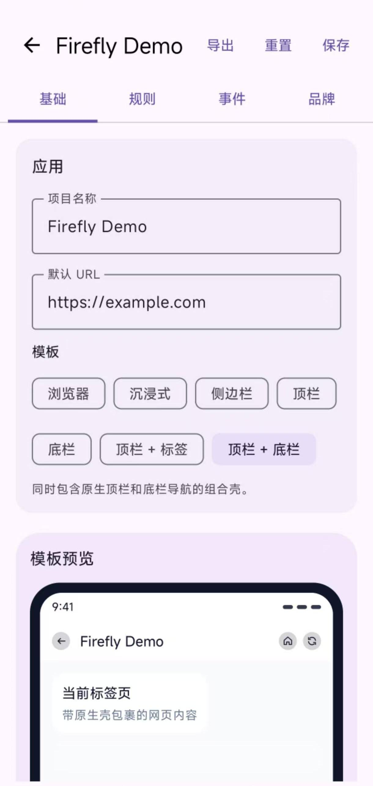

<p align="center">
  
</p>

<h1 align="center">FireflyApp</h1>

<p align="center">
  <b>将任意网站打包成精致的 Android 原生应用</b><br>
  Turn any website into a polished Android app
</p>

<p align="center">
  
  
  
  
  
</p>

---

## ✨ 简介

**FireflyApp** 是一个运行在 Android 设备上的 **Web-to-App 本地打包工具**。无需编写任何代码，仅通过一个 JSON 配置文件，即可将网站封装为具备原生导航壳（底部导航栏、顶部工具栏、侧滑抽屉等）的独立 Android 应用，并直接在设备上完成 APK 签名和安装。

### 核心特性

- 🎨 **7 种 UI 模板** — 浏览器 / 沉浸全屏 / 顶栏 / 底栏 / 顶栏 + 标签 / 顶栏 + 底栏 / 侧边栏
- 📦 **设备端本地打包** — 无需电脑，直接在手机上完成 APK 重打包与签名
- 🛠 **可视化配置编辑器** — 分 Tab 编辑所有配置项（Basic / Rules / Events / Branding / Build）
- 🌐 **完整 WebView 能力** — Cookie、localStorage、IndexedDB、文件上传下载、地理位置
- 🔒 **安全策略** — 域名白名单、外链拦截、SSL 证书错误处理可配置
- 🎯 **页面规则 & 事件** — 按 URL 匹配注入 JS/CSS、自定义错误页、监听页面生命周期
- 🌙 **夜间模式** — 支持跟随系统主题或手动开启
- 🌍 **多语言** — 简体中文 / English，支持跟随系统

---

## 📱 截图

<div style="display:flex;gap:16px;flex-wrap:wrap;max-width:100%;"></div>

---

---

## 🏗 项目结构

```
FireflyApp/
├── app/                            # 宿主应用（Host App）
│   ├── src/main/
│   │   ├── java/com/fireflyapp/lite/
│   │   │   ├── app/                # Application 入口、常量配置、多语言管理
│   │   │   ├── core/               # 核心功能模块
│   │   │   │   ├── clipboard/      #   ← 剪贴板 JS Bridge
│   │   │   │   ├── config/         #   ← 配置解析、校验、管理
│   │   │   │   ├── download/       #   ← 文件下载（标准 + Blob）
│   │   │   │   ├── event/          #   ← 页面事件分发与 SPA 路由检测
│   │   │   │   ├── notification/   #   ← 通知 JS Bridge（NotificationBridge）
│   │   │   │   ├── pack/           #   ← APK 打包引擎（核心）
│   │   │   │   ├── permission/     #   ← WebView 运行时权限（摄像头/麦克风/地理位置）
│   │   │   │   ├── project/        #   ← 项目包导入/导出
│   │   │   │   ├── rule/           #   ← 页面规则匹配与应用
│   │   │   │   └── webview/        #   ← WebView / WebViewClient / FileChooserHandler
│   │   │   ├── data/
│   │   │   │   ├── model/          #   ← 数据模型（AppConfig, ShellConfig, ...）
│   │   │   │   └── repository/     #   ← ConfigRepository（项目管理核心）
│   │   │   └── ui/
│   │   │       ├── config/         #   ← 可视化配置编辑器（Compose）
│   │   │       ├── help/           #   ← 说明文档页（HelpDocumentActivity）
│   │   │       ├── icon/           #   ← 图标设计器 + 图标仓库
│   │   │       │   ├── IconDesignerActivity.kt  # 自定义图标设计与导出
│   │   │       │   ├── IconCatalogActivity.kt   # 内置图标浏览与搜索
│   │   │       │   └── IconDesignerSupport.kt   # 图标渲染与导出工具
│   │   │       ├── main/           #   ← SplashActivity + MainActivity
│   │   │       ├── pack/           #   ← 打包界面（含产物自检卡片）
│   │   │       ├── project/        #   ← 项目中心（ProjectHub, Compose UI）
│   │   │       ├── template/       #   ← 7 种模板 Fragment
│   │   │       └── web/            #   ← WebContainerFragment（WebView 容器）
│   │   ├── assets/
│   │   │   ├── app-config.json     # 内置默认配置示例
│   │   │   └── local-help/         # 内置帮助文档（构建时从 help/ 复制）
│   │   └── res/                    # 资源文件（布局、图标、多语言字符串）
│   └── build.gradle.kts
│
├── runtimeTemplate/                # 运行时模板模块
│   ├── src/main/
│   │   └── AndroidManifest.xml     # 模板 Manifest（含占位符）
│   └── build.gradle.kts            # 共享 app 模块的源码，独立编译为壳 APK
│
├── help/                           # 内置帮助文档源文件
│   ├── index.html                  # 中英双语单页文档（暗色主题）
│   └── firefly.jpg                 # 文档用图标
├── images/                         # 项目图片资源           
└── md_images/                      # MD文档图片资源        
```

---

## 🚀 快速开始

### 环境要求

| 工具 | 版本 |
|------|------|
| Android Studio | Hedgehog 或更高 |
| JDK | 17+ |
| Gradle | 8.x（通过 Gradle Wrapper 自动管理） |
| Kotlin | 1.9.24 |
| AGP | 8.5.2 |

### 编译运行

```bash
# 1. 克隆项目
git clone https://github.com/Iskongkongyo/FireflyApp.git
cd FireflyApp

# 2. 配置签名（可选，用于 Release 构建）
#    编辑 signing.properties，配置你自己的 keystore 路径和密码

# 3. 编译并安装到设备
./gradlew :app:installDebug
```

> **提示**：首次编译会自动触发 `runtimeTemplate:assembleRelease` 任务，编译模板 APK 并打包到宿主应用的 assets 中。

### 使用流程

```
创建项目 → 编辑配置 → 预览效果 → Pack 打包 → 安装/分享 APK
```

1. 打开 FireflyApp → 进入 **Project Hub**（项目中心）
2. 点击 **New Project** 创建新项目
3. 在 **Config Editor** 中配置目标网站 URL、模板类型、导航项等
4. 点击 **Preview** 实时预览效果
5. 进入 **Pack** 界面 → **Prepare** → **Pack** → 生成签名 APK
6. 直接 **Install** 安装，或 **Share** 分享给他人

---

## 📐 配置结构

所有行为由 `app-config.json` 驱动，结构如下：

```jsonc
{
  "schemaVersion": 1,

  // 应用基本信息
  "app": {
    "name": "My App",                    // 应用名称
    "template": "bottom_bar",            // 模板类型
    "defaultUrl": "https://example.com"  // 默认主页 URL
  },

  // WebView 浏览器配置
  "browser": {
    "javaScriptEnabled": true,           // JavaScript 开关
    "domStorageEnabled": true,           // DOM Storage (localStorage/sessionStorage)
    "userAgent": "",                     // 自定义 User-Agent（留空使用系统默认）
    "showLoadingOverlay": true,          // 加载遮罩
    "showPageProgressBar": true,         // 页面进度条
    "showErrorView": true,              // 错误页
    "backAction": "go_back_or_exit",     // 返回键行为
    "nightMode": "off"                   // 夜间模式: off / on / follow_theme
  },

  // 原生壳配置（TopBar / BottomBar / Drawer 的视觉参数）
  "shell": {
    "topBarShowBackButton": true,
    "topBarShowRefreshButton": true,
    "topBarHomeBehavior": "default_home",
    "topBarRefreshBehavior": "reload",
    "topBarFollowPageTitle": true,
    "topBarCornerRadiusDp": 18,
    "bottomBarShowTextLabels": true,
    "bottomBarCornerRadiusDp": 22,
    "bottomBarBadgeColor": "#E11D48",
    "drawerHeaderTitle": "My App",
    "drawerWidthDp": 320
    // ... 约 50 个可配置字段
  },

  // 导航项（最多 5 个）
  "navigation": {
    "items": [
      {
        "id": "home",
        "title": "Home",
        "url": "https://example.com",
        "icon": "home",
        "selectedIcon": "home",          // supports built-in IDs or custom://branding/custom-icons/...
        "badgeCount": "",
        "showUnreadDot": false
      }
    ]
  },

  // 安全策略
  "security": {
    "allowedHosts": ["example.com"],     // 域名白名单
    "allowExternalHosts": false,         // 是否允许打开白名单外的 URL
    "openOtherAppsMode": "ask",          // 跳转外部应用: ask / allow / block
    "sslErrorHandling": "strict"         // SSL 证书错误处理: strict / ignore
  },

  // 全局注入
  "inject": {
    "globalJs": ["console.log('injected');"],
    "globalCss": ["body { overscroll-behavior: none; }"]
  },

  // 页面规则（按 URL 匹配应用覆盖配置）
  "pageRules": [
    {
      "match": { "urlContains": "example.com" },
      "overrides": {
        "title": "Custom Title",
        "injectCss": ["..."],
        "injectJs": ["..."],
        "errorTitle": "Page Failed",
        "errorRetryAction": "load_url",
        "errorRetryUrl": "https://..."
      }
    }
  ],

  // 页面事件（监听页面生命周期并执行动作）
  "pageEvents": [
    {
      "id": "event-1",
      "enabled": true,
      "trigger": "page_finished",        // 触发器
      "match": { "urlStartsWith": "..." },
      "actions": [
        { "type": "toast", "value": "Page loaded: {url}" }
      ]
    }
  ]
}
```

---

## 🎨 UI 模板

| 模板 | 标识 | 说明 |
|------|------|------|
| **Browser** | `browser` | 纯 WebView 全屏，无原生导航栏 |
| **Immersive** | `immersive_single_page` | 沉浸全屏，隐藏状态栏和导航栏 |
| **Top Bar** | `top_bar` | 顶部工具栏 + WebView，支持标题/返回/刷新 |
| **Bottom Bar** | `bottom_bar` | 底部 Tab 导航，最多 5 个标签页 |
| **Top + Tabs** | `top_bar_tabs` | 顶部工具栏 + 顶部标签导航 |
| **Top + BottomBar** | `top_bar_bottom_tabs` | 顶部工具栏 + 底栏导航 |
| **Side Drawer** | `side_drawer` | 侧滑抽屉菜单，支持自定义壁纸和头像 |

---

## 📦 打包原理

FireflyApp 采用 **Template APK Repack** 方案实现设备端本地打包：

```
runtimeTemplate 模块编译
       ↓
unsigned 壳 APK（含占位符）
       ↓ 打包到宿主 assets
   ┌───────────────────────────────┐
   │  用户点击 Pack                 │
   │  1. 解压模板 APK               │
   │  2. 注入项目 app-config.json   │
   │  3. 替换启动图标                │
   │  4. 注入 Splash / Drawer 资产  │
   │  5. 二进制修改 AndroidManifest │
   │     · 包名 → 项目包名          │
   │     · 应用名 → 项目应用名       │
   │     · 版本号 → 项目版本号       │
   │  6. 重新打包 unsigned APK      │
   │  7. zipalign 对齐             │
   │  8. APK 签名（AndroidKeyStore  │
   │     或用户自定义 JKS）          │
   │  9. 产物自检 ✅                │
   │     · Manifest 完整性校验      │
   │     · APK 签名校验             │
   │     · PackageParser 可安装性验证│
   └───────────────────────────────┘
       ↓
  signed APK → 安装 / 分享
```

**关键技术**：
- `BinaryManifestPatcher` 直接操作编译后的二进制 `AndroidManifest.xml`，绕过 AAPT 依赖，实现纯 Java/Kotlin 的包名、应用名、版本号替换。
- 打包完成后自动执行**产物自检**（Artifact Self-Check），验证 Manifest 完整性、APK 签名有效性、及系统 PackageParser 的可安装性，在安装前发现潜在问题。

---

## 🌐 WebView 能力

| 能力 | 支持 | 说明 |
|------|------|------|
| Cookie | ✅ | 自动启用，支持第三方 Cookie |
| localStorage / sessionStorage | ✅ | DOM Storage 默认开启 |
| IndexedDB | ✅ | 随 DOM Storage 启用 |
| 文件下载 | ✅ | 标准 URL 下载 + Blob 二进制下载 |
| 文件上传 | ✅ | `FileChooserHandler` 支持标准 file input |
| 剪贴板 | ✅ | JS Bridge：`FireflyClipboard` |
| 通知 | ✅ | JS Bridge：`FireflyNotificationBridge`（含权限提示） |
| 地理位置 | ✅ | `WebGeolocationHandler` 权限管理 + 白名单校验 |
| 摄像头 / 麦克风 | ✅ | `WebPermissionHandler` 双语权限前置提示 |
| 全屏视频 | ✅ | 自动进入/退出全屏 |
| 夜间模式 | ✅ | Algorithmic Darkening + 跟随宿主主题 |
| JS/CSS 注入 | ✅ | 全局注入 + 页面规则级注入 |
| SPA 路由检测 | ✅ | MutationObserver 监听 URL 变化 |

### 权限管理

打包后的 APP 在需要敏感权限时，会先弹出**双语权限前置提示对话框**（中文/英文跟随系统语言），向用户说明权限用途和请求来源域名，用户确认后才触发系统权限弹窗。已涵盖的权限提示：

| 权限 | 实现类 | 说明 |
|------|--------|------|
| 摄像头 / 麦克风 | `WebPermissionHandler` | 基于 `PermissionRequest` 的域名校验 + 持久化记忆 |
| 通知 | `NotificationBridge` | Android 13+ `POST_NOTIFICATIONS` 双重确认 |
| 地理位置 | `WebGeolocationHandler` | `onGeolocationPermissionsShowPrompt` 处理 |
| 文件选择 | `FileChooserHandler` | 标准 `onShowFileChooser` + `accept` 类型过滤 |

---

## 🔔 页面事件系统

### 触发器（Trigger）

| 触发器 | 说明 |
|--------|------|
| `page_started` | 页面开始加载 |
| `page_finished` | 页面加载完成 |
| `page_title_changed` | 页面标题变化 |
| `page_left` | 离开页面（导航到新页面前） |
| `spa_url_changed` | SPA 单页应用内路由变化 |

### 动作（Action）

| 动作 | 说明 |
|------|------|
| `toast` | 显示 Toast 消息 |
| `load_url` | 加载指定 URL |
| `open_external` | 用外部浏览器打开 |
| `reload` | 重新加载当前页 |
| `reload_ignore_cache` | 清缓存重新加载 |
| `go_back` | 返回上一页 |
| `copy_to_clipboard` | 复制文本到剪贴板 |
| `run_js` | 执行自定义 JavaScript |

**模板变量**：动作的 `value` / `url` / `script` 字段支持 `{url}`、`{title}`、`{trigger}`、`{previousUrl}`、`{nextUrl}` 模板变量。

---

## 🗂 侧边栏工具

项目中心（Project Hub）左侧抽屉提供以下快捷入口：

| 入口 | 说明 |
|------|------|
| 📄 **说明文档** | 内置中英双语帮助文档，通过 `WebViewAssetLoader` 加载本地 HTML |
| 🎨 **图标设计** | 自定义应用图标：选图/文字 + 调背景色/透明背景 + 圆角 + 尺寸 → 导出 PNG |
| 📦 **图标仓库** | 浏览内置 Material 图标目录，一键复制图标名到配置 |
| 🌐 **多语言切换** | 中文 / English / 跟随系统 三模式切换 |
| 👁 **数据面板** | 显示/隐藏项目中心的统计仪表盘 |
| ℹ️ **关于** | 版本信息与开源协议 |

---

## 🔒 安全机制

| 安全点 | 措施 |
|--------|------|
| URL 导航 | `allowedHosts` 域名白名单，支持通配符（`*.example.com`） |
| 外部应用跳转 | `ask` / `allow` / `block` 三模式，弹窗显示目标应用信息 |
| SSL 错误 | 可配置为严格校验或忽略证书错误（默认严格校验） |
| 文件路径 | `sanitizeRelativeProjectPath()` 防止 `../` 路径穿越 |
| 打包名 | 正则校验 + 长度限制 + 禁止与宿主包名重复 |
| 签名凭据 | 存于 APP 私有沙盒目录 |

---

## 🧩 技术栈

| 技术 | 版本 / 说明 |
|------|-------------|
| **Kotlin** | 1.9.24 |
| **Android Gradle Plugin** | 8.5.2 |
| **Jetpack Compose** | BOM 2024.09.03（ProjectHub / ConfigEditor） |
| **View + ViewBinding** | Template Fragment / WebView 层 |
| **kotlinx.serialization** | 1.6.3（JSON 配置解析） |
| **AndroidX WebKit** | 1.11.0（WebView 增强） |
| **apksig** | 8.5.2（APK 签名） |
| **uCrop** | 2.2.10（图片裁剪） |
| **Material 3** | 1.12.0 |
| **Architecture** | MVVM（ViewModel + StateFlow） |

---

## ⚙️ 编译配置

### 签名配置

项目使用 `signing.properties` 管理签名密钥：

```properties
storeFile=firefly-release.jks
storePassword=your_password
keyAlias=your_alias
keyPassword=your_key_password
```

> ⚠️ **安全提醒**：如果要开源发布，请将 `signing.properties` 和 `.jks` 文件添加到 `.gitignore`，改用 CI/CD 环境变量注入。

### 构建任务依赖

```
:app:preBuild
  ├── copyBundledTemplateApk   ← 编译 runtimeTemplate 并复制 unsigned APK 到 assets
  ├── generateRuntimeShellTemplate  ← 打包 Gradle 项目骨架为 ZIP（Local Build 用）
  └── copyLocalHelpDocs        ← 复制帮助文档到 assets
```

---

## ✨ 近期更新

- 新增了一个真正的“顶部 + 标签页”模板，并保留了现有的“顶部 + 底部栏”模板。
- 在“基础设置”中，为“主页”和“刷新”按钮的行为新增了 `run_js` 支持。
- 图标选择器现支持从相册导入自定义的 `PNG / JPEG / WebP` 格式图标。
- 图标设计器现支持导出带有透明背景的图标素材。
- “基础设置 -> 安全”现支持配置 SSL 证书错误的处理方式。
- 滑动导航过渡效果、打包历史归档命名方式，以及权限授予后的安装流程均已得到改进。

## 🤝 贡献

欢迎提交 Issue 和 Pull Request！

1. Fork 本项目
2. 创建你的功能分支 (`git checkout -b feature/amazing-feature`)
3. 提交你的修改 (`git commit -m 'Add amazing feature'`)
4. Push 到分支 (`git push origin feature/amazing-feature`)
5. 提交 Pull Request

---

## ⚠️ 免责声明

本应用是一个本地 Web-to-App 打包工具。使用本工具时，请确保：

1. 你已获得目标网站内容和品牌资产的合法使用授权
2. 你对项目配置、打包输出、分发行为及法律合规性承担全部责任
3. 遵守目标网站的服务条款和相关法律法规

---

## 🙏 致谢

感谢以下开源项目与社区，没有它们就没有 FireflyApp：

- [**Jetpack Compose**](https://developer.android.com/jetpack/compose) — 现代声明式 UI 框架，驱动项目中心与配置编辑器
- [**AndroidX WebKit**](https://developer.android.com/jetpack/androidx/releases/webkit) — WebView 增强能力的基石
- [**apksig**](https://android.googlesource.com/platform/tools/apksig/) — Google 官方 APK 签名库，保障打包产物的签名安全
- [**kotlinx.serialization**](https://github.com/Kotlin/kotlinx.serialization) — 类型安全的 JSON 解析，支撑配置系统
- [**uCrop**](https://github.com/Yalantis/uCrop) — 优雅的图片裁剪组件，用于启动图标与 Splash 编辑
- [**Material Design 3**](https://m3.material.io/) — 设计语言与组件库
- [**Android Open Source Project**](https://source.android.com/) — 底层平台支持
- [**Pillo**](https://x.com/Pillo_0000) - APP流萤启动图作者
- [**siyo_studio_v3**](https://x.com/siyo_studio_v3/status/2008525469272949032) - APP侧边栏背景图来源

同时感谢所有提交 Issue 和 Pull Request 的贡献者们 ❤️
